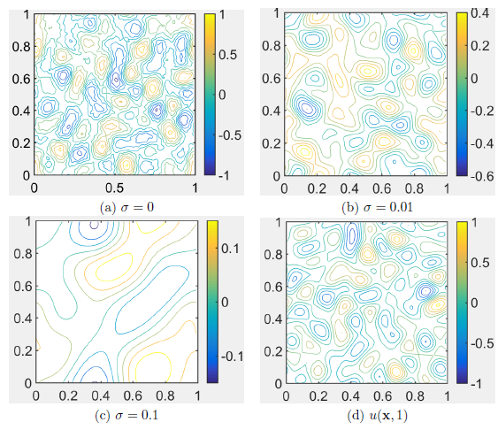
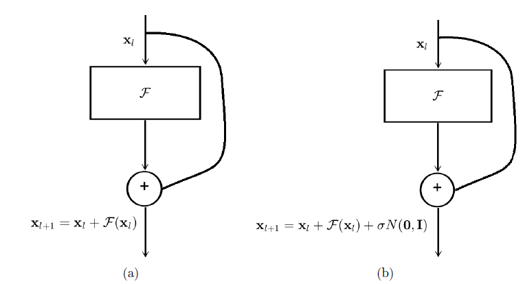
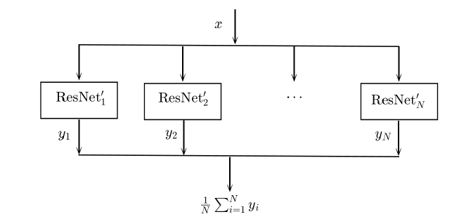

# EnResNet
This repository consists PyTorch code for the paper:
Bao Wang, Binjie Yuan, Zuoqiang Shi, Stanley J. Osher. EnResNet: ResNet Ensemble via the Feynman-Kac Formalism, arXiv:1811.10745, 2018 (https://arxiv.org/abs/1811.10745)

The repo contains two subfolders for PGD adversarially training of ensemble of ResNet20 and WideResNet34-10, respectively. 

We inteprete the adversarial vulnerability of ResNets as irregularity of the solution of the transport equation, and we propose to improve regularity of the decision boundary by adding diffusion to the transport equation. Please refer to Figure 4 of our [paper](https://arxiv.org/abs/1811.10745) for more details.

<p align="center">
    
</p>

The resulted convection-diffusion equation can be solved by using the Feynman-Kac formula, which can be approximated by an ensemble of modified ResNets.

<p align="center">
    
</p>

<p align="center">
    
</p>

If you find this work useful and use it on you own research, please cite our [paper](https://arxiv.org/abs/1811.10745)

```
@ARTICLE{Wang2018EnResNet,
       author = {{B. Wang and B. Yuan and Z. Shi and S. Osher},
        title = "{ResNets Ensemble via the Feynman-Kac Formalism to Improve Natural and Robust Accuracies}",
      journal = {arXiv e-prints},
         year = "2018",
        month = "Nov",
          eid = {arXiv:1811.10745},
        pages = {arXiv:1811.10745},
archivePrefix = {arXiv},
       eprint = {1811.10745},
 primaryClass = {stat.ML}
}
```

## Dependence
PyTorch 0.4.1
